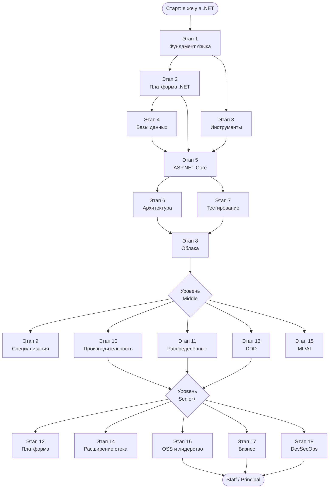
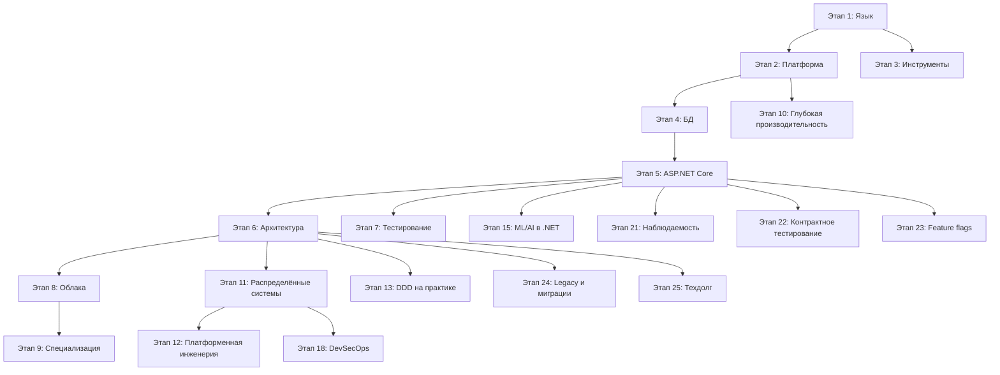

# C# Roadmap: с нуля до профи

    
> 🇬🇧 **English version**: [csharfullroadmap](https://github.com/Develp10/csharfullroadmap)


> 📢 **Telegram-канал автора:** [t.me/csharp_ci](https://t.me/csharp_ci) — обновления roadmap, материалы по C# и .NET, разбор практик и полезные ссылки.

Практическое руководство по росту в C#-разработке. Материал собран для тех, кто хочет получить инженерную глубину, а не просто накликать CRUD по туториалам. Здесь последовательность изучения, лучшие практики, ресурсы и трезвый разбор того, как работать с ИИ-инструментами и оставаться востребованным.

> Roadmap живой. PR с уточнениями, ссылками и опытом приветствуются. См. раздел [Contributing](#contributing).

---

## TL;DR за 30 секунд

**Что это.** Сценарий роста от джуна до principal в .NET-стеке. 25 этапов, ресурсы, практики, чек-листы.

**Кому подойдёт.** Тем, кто учит C# с нуля, готовится к собеседованию, выбирается из плато middle-разработчика или хочет понять, чего не хватает для роли senior+.

**С чего начать прямо сейчас:**

1. Откройте [Как пользоваться этим roadmap](#как-пользоваться-этим-roadmap) и [Матрицу «этап → уровень»](#матрица-этап--уровень).
2. Найдите свой уровень. Возьмите 1 этап из «обязательно», который у вас закрыт хуже всего.
3. Закройте его за 2–4 недели по схеме: чтение → конспект → pet-проект → ретроспектива.
4. Возвращайтесь сюда раз в неделю с конкретным вопросом, а не «что бы ещё почитать».

**Если коротко.** Глубокий фундамент важнее модного стека. Pet-проект важнее курса. Английский B2 умножает зарплату. ИИ-инструменты ускоряют рутину и убивают навыки, если ими подменять мышление.

---

## Пять правил выживания в индустрии

Сжатая версия лучших практик. Распечатайте и повесьте над монитором.

1. **Простое решение по умолчанию.** Усложняйте, только когда требование пришло из реальности, а не из воображения.
2. **Не оптимизируйте без измерений.** Профайлер и BenchmarkDotNet опровергнут половину ваших интуиций.
3. **Каждый async-метод принимает CancellationToken.** Без исключений.
4. **Тестируйте поведение, а не реализацию.** Чрезмерное моканье — это запах архитектуры.
5. **Документируйте «почему», а не «что».** Что делает код, видно в коде. Почему именно так — нет.

---

## Как пользоваться этим roadmap

- Не пытайтесь пройти всё подряд за квартал. Это карта на 3–5 лет осознанной работы.
- Этапы 1–8 — базовая траектория от джуна до уверенного мидла. Идите по порядку.
- Этапы 9–17 — специализация и Senior+. Берите то, что нужно вашему рынку и продукту.
- Каждый этап = чтение + конспект + рабочий проект + ретроспектива. Без проекта тема не считается пройденной.
- Возвращайтесь к ранее пройденному раз в полгода: фундамент меняет смысл, когда вы выросли.
- Отмечайте прогресс в форке этого репозитория. Публичный коммит-стрик дисциплинирует лучше любого ментора.

## Оглавление

- [Зачем учить код в эпоху ИИ](#зачем-учить-код-в-эпоху-ии)
- [Этап 1. Фундамент языка и платформы](#этап-1-фундамент-языка-и-платформы-12-месяца)
- [Этап 2. Глубже в платформу .NET](#этап-2-глубже-в-платформу-net-12-месяца)
- [Этап 3. Инструменты профессионала](#этап-3-инструменты-профессионала-параллельно-с-этапом-2)
- [Этап 4. Базы данных и доступ к данным](#этап-4-базы-данных-и-доступ-к-данным-12-месяца)
- [Этап 5. ASP.NET Core и веб-разработка](#этап-5-aspnet-core-и-веб-разработка-23-месяца)
- [Этап 6. Архитектура и проектирование](#этап-6-архитектура-и-проектирование-постоянно)
- [Этап 7. Качество кода и тестирование](#этап-7-качество-кода-и-тестирование-постоянно)
- [Этап 8. Облака и эксплуатация](#этап-8-облака-и-эксплуатация-12-месяца)
- [Этап 9. Специализация](#этап-9-специализация)
- [Этап 10. Глубокая производительность](#этап-10-глубокая-производительность-и-системное-программирование)
- [Этап 11. Распределённые системы](#этап-11-распределённые-системы-продвинутого-уровня)
- [Этап 12. Платформенная инженерия](#этап-12-платформенная-инженерия)
- [Этап 13. DDD на практике](#этап-13-доменно-управляемое-проектирование-на-практике)
- [Этап 14. Расширение стека](#этап-14-расширение-стека-за-пределы-c)
- [Этап 15. ML и AI-инженерия](#этап-15-ml-и-ai-инженерия-в-net-стеке)
- [Этап 16. Open source и техническое лидерство](#этап-16-open-source-и-техническое-лидерство)
- [Этап 17. Бизнес-контекст](#этап-17-бизнес-контекст-и-продуктовое-мышление)
- [Этап 18. DevSecOps и Supply Chain Security](#этап-18-devsecops-и-supply-chain-security)
- [Этап 19. Documentation as Code](#этап-19-documentation-as-code-и-инженерное-письмо)
- [Этап 20. Устойчивая карьера и этика](#этап-20-устойчивая-карьера-этика-и-долгая-игра)
- [Этап 21. Наблюдаемость](#этап-21-наблюдаемость-на-уровне-senior)
- [Этап 22. Контрактное тестирование и эволюция API](#этап-22-контрактное-тестирование-и-эволюция-api)
- [Этап 23. Feature flags и progressive delivery](#этап-23-feature-flags-и-progressive-delivery)
- [Этап 24. Работа с legacy и крупные миграции](#этап-24-работа-с-legacy-и-крупные-миграции)
- [Этап 25. Управление техническим долгом](#этап-25-управление-техническим-долгом-как-процесс)
- [Визуальная карта роста](#визуальная-карта-роста)
- [План на первые 90 дней](#план-на-первые-90-дней-для-тех-кто-только-начинает)
- [Структура pet-проекта](#минимальная-структура-pet-проекта-которая-открывает-двери)
- [Эталонные сниппеты идиоматического C#](#эталонные-сниппеты-что-отличает-идиоматический-c-от-кода-на-c-со-стилем-java)
- [Идеи pet-проектов по уровням](#идеи-pet-проектов-по-уровню-сложности)
- [Глоссарий ключевых терминов](#глоссарий-ключевых-терминов)
- [Расширенные ресурсы](#расширенные-ресурсы-по-этапам)
- [Шаблон еженедельной ретроспективы](#шаблон-еженедельной-ретроспективы-обучения)
- [Лучшие практики](#лучшие-практики-которые-экономят-годы)
- [Как работать с ИИ-инструментами](#как-работать-с-ии-инструментами-и-не-деградировать)
- [Чек-лист готовности к уровням](#чек-лист-готовности-к-уровням)
- [Антипаттерны обучения](#антипаттерны-обучения-чего-избегать)
- [Минимальная книжная полка](#минимальная-книжная-полка)
- [Awesome-ресурсы и сообщества](#awesome-ресурсы-и-сообщества)
- [FAQ](#faq)
- [Contributing](#contributing)
- [License](#license)

---

## Зачем учить код в эпоху ИИ

ИИ генерирует текст, похожий на код. Инженер отвечает за то, чтобы система держала нагрузку, не теряла деньги клиента и не падала ночью в проде. Языковая модель не знает контекст вашего бизнеса, не читает требования между строк, не несёт ответственности за архитектурное решение, которое будет жить пять лет.

Чтобы пользоваться ИИ как рычагом, нужно понимать, что он сгенерировал. Видеть гонки в async-коде, отличать рабочий паттерн от карго-культа, читать legacy и проектировать модули так, чтобы их можно было поддерживать. Без фундамента вы будете нажимать Tab в Copilot и копить технический долг, который потом сами не разгребёте.

Рынок смещается от джунов, штампующих формочки, к инженерам уровня middle+, которые проектируют системы и валидируют ИИ-вывод. Учиться нужно глубже, чем раньше, а не поверхностнее.

---

## Этап 1. Фундамент языка и платформы (1–2 месяца)

Установите актуальный .NET SDK (LTS — .NET 8, текущий релиз — .NET 9), JetBrains Rider или Visual Studio. VS Code с расширением C# Dev Kit тоже рабочий вариант для тех, кто привык к лёгкому редактору.

Что осваиваем на этом этапе:

* Синтаксис C#: типы значений и ссылок, nullable reference types, pattern matching, records, init-only свойства, switch expressions.
* Управляющие конструкции, методы, перегрузки, опциональные и именованные аргументы.
* ООП по делу: инкапсуляция, наследование, полиморфизм, интерфейсы, абстрактные классы. Понимание, когда композиция предпочтительнее наследования.
* Generics, ограничения типов, ковариантность и контравариантность.
* Делегаты, события, лямбда-выражения, замыкания и их подводные камни.
* Исключения: иерархия, when-фильтры, finally, корректное пробрасывание без потери стека (throw vs throw ex).
* Базовая работа с коллекциями: List, Dictionary, HashSet, Queue, Stack, ImmutableCollections.
* LINQ to Objects: deferred execution, материализация, типичные ошибки производительности.

Ресурсы:

* Книга «C# in Depth» Jon Skeet — обязательный минимум для понимания языка.
* Официальная документация Microsoft Learn по C# и .NET.
* Канал Nick Chapsas на YouTube для коротких практических разборов.
* Курс «C# Fundamentals» на Pluralsight (Scott Allen).

Практика: написать консольное приложение средней сложности (например, текстовый менеджер задач с сохранением в JSON), решить 50–100 задач на LeetCode или Codewars на C#.

---

## Этап 2. Глубже в платформу .NET (1–2 месяца)

Здесь начинается то, что отличает джуна от мидла. Нужно понимать, как именно ваш код выполняется.

Темы:

* CLR, JIT, AOT, Tiered Compilation, ReadyToRun.
* Управление памятью: стек, куча, поколения GC, Large Object Heap, Server vs Workstation GC.
* Span<T>, Memory<T>, ref struct, stackalloc и зачем они нужны.
* Async/await изнутри: SynchronizationContext, ConfigureAwait, ValueTask, отмена через CancellationToken, ловушки sync-over-async и async void.
* Thread, ThreadPool, Task, Parallel, Channels, примитивы синхронизации (lock, SemaphoreSlim, Interlocked, ReaderWriterLockSlim).
* Reflection, атрибуты, Source Generators (современная альтернатива рефлексии в горячих путях).
* IO: потоки, Pipelines, асинхронные файловые операции.
* Сериализация: System.Text.Json, контракты, кастомные конвертеры, производительность по сравнению с Newtonsoft.Json.

Ресурсы:

* «Pro .NET Memory Management» Konrad Kokosa — глубокое погружение в GC.
* «Concurrency in C# Cookbook» Stephen Cleary.
* Блог Stephen Toub на devblogs.microsoft.com — лучший источник по производительности и async.
* Канал Nick Chapsas, серии по производительности.

Практика: написать свой LRU-кеш, простой пул объектов, измерить производительность через BenchmarkDotNet.

---

## Этап 3. Инструменты профессионала (параллельно с этапом 2)

Без этих инструментов не возьмут на сильную команду:

* Git: branching strategies (trunk-based, GitHub Flow), rebase, cherry-pick, разрешение конфликтов, работа с большими репозиториями.
* Командная строка, базовый Bash или PowerShell.
* Docker: образы, слои, multi-stage builds, docker-compose, сетевые режимы.
* Linux на уровне уверенного пользователя: процессы, права, systemd, логирование.
* CI/CD: GitHub Actions или Azure DevOps Pipelines.
* Отладка: дампы памяти, dotnet-dump, dotnet-counters, dotnet-trace, PerfView.
* BenchmarkDotNet для измерения производительности и опровержения собственных интуиций.

Ресурсы:

* Pro Git book (бесплатно на git-scm.com).
* «Docker Deep Dive» Nigel Poulton.
* Microsoft Learn по диагностике .NET-приложений.

---

## Этап 4. Базы данных и доступ к данным (1–2 месяца)

* SQL на уровне уверенного владения: JOIN, подзапросы, оконные функции, индексы, планы выполнения, транзакции и уровни изоляции.
* PostgreSQL и SQL Server в качестве основных СУБД.
* Entity Framework Core: change tracking, lazy/eager/explicit loading, проблема N+1, AsNoTracking, compiled queries, миграции.
* Dapper и raw ADO.NET для горячих путей и сложных запросов.
* Redis для кеширования и очередей.
* Базово NoSQL: MongoDB или Cosmos DB, понимание, когда они уместны.

Ресурсы:

* «SQL Antipatterns» Bill Karwin.
* «Use the Index, Luke» (бесплатно онлайн) — лучший материал по индексам.
* Документация EF Core с разделом про производительность.

Практика: написать сервис, который грузит миллион записей из БД, найти и устранить N+1, замерить разницу.

---

## Этап 5. ASP.NET Core и веб-разработка (2–3 месяца)

* Kestrel, middleware pipeline, DI-контейнер, конфигурация и Options pattern.
* Minimal APIs и контроллеры, когда что выбирать.
* Аутентификация и авторизация: JWT, OAuth 2.0, OpenID Connect, Identity, политики и роли.
* Валидация (FluentValidation), маппинг (Mapster, ручной маппинг вместо AutoMapper в новых проектах).
* Логирование через ILogger, структурированные логи, Serilog, OpenTelemetry для трейсинга и метрик.
* gRPC, SignalR, GraphQL (HotChocolate) обзорно, под задачи.
* Версионирование API, Swagger/OpenAPI, идемпотентность, обработка ошибок (ProblemDetails).
* Health checks, graceful shutdown, конфигурация через переменные окружения и секрет-сторы.

Ресурсы:

* «ASP.NET Core in Action» Andrew Lock.
* Блог Andrew Lock (andrewlock.net) — глубокие разборы внутренностей.
* Документация Microsoft по ASP.NET Core.

Практика: построить API для задач с аутентификацией, ролями, логированием, контейнеризацией и деплоем в облако.

---

## Этап 6. Архитектура и проектирование (постоянно)

* SOLID без фанатизма, понимание реальной цены каждого принципа.
* DDD: агрегаты, value objects, bounded contexts, ubiquitous language. Читать «Domain-Driven Design» Эванса и «Implementing DDD» Вернона.
* Clean Architecture, Hexagonal, Onion. Уметь объяснить, какую проблему решает каждая.
* CQRS и MediatR, Event Sourcing (понимать, когда уместно).
* Паттерны интеграции: Outbox, Saga, Idempotency Key, Retry с exponential backoff, Circuit Breaker (Polly).
* Микросервисы vs модульный монолит. По умолчанию строим модульный монолит, к микросервисам переходим осознанно.
* Очереди и брокеры: RabbitMQ, Kafka, Azure Service Bus. MassTransit как абстракция.
* Распределённые транзакции, eventual consistency, CAP-теорема на практике.

Ресурсы:

* «Designing Data-Intensive Applications» Martin Kleppmann — главная книга десятилетия для бэкендера.
* «Building Microservices» Sam Newman.
* Блог Vladimir Khorikov (enterprisecraftsmanship.com).
* Канал CodeOpinion (Derek Comartin).

---

## Этап 7. Качество кода и тестирование (постоянно)

* Unit-тесты: xUnit, NUnit. FluentAssertions для читаемых ассертов.
* Моки: NSubstitute или Moq. Чрезмерное моканье сигнализирует о проблемах архитектуры.
* Интеграционные тесты через WebApplicationFactory и Testcontainers (поднимаем реальный Postgres в Docker для тестов).
* Подходы: TDD там, где есть смысл; Arrange-Act-Assert; Given-When-Then.
* Property-based тестирование (FsCheck) для алгоритмов.
* Code review культура, статический анализ (Roslyn analyzers, SonarQube), EditorConfig.
* Покрытие: важно не число процентов, а покрытие критичных путей.

Ресурсы:

* «Unit Testing: Principles, Practices, and Patterns» Vladimir Khorikov.
* «The Art of Unit Testing» Roy Osherove.

---

## Этап 8. Облака и эксплуатация (1–2 месяца)

* Azure или AWS на уровне сертификации Associate. Для .NET-стека Azure ближе, но AWS тоже даёт работу.
* Kubernetes основы: Pod, Deployment, Service, Ingress, ConfigMap, Secret, Helm.
* Observability: метрики (Prometheus, Application Insights), трейсинг (Jaeger, OpenTelemetry), логи (Loki, ELK).
* Infrastructure as Code: Terraform или Bicep.
* Безопасность: OWASP Top 10, секрет-менеджмент, безопасное хранение токенов, защита от SQL injection и SSRF.

---

## Этап 9. Специализация

После прохождения базы выбираем углубление:

* Высоконагруженный бэкенд: производительность, low-allocation код, Span<T>, профилирование.
* Распределённые системы: Kafka, Event Sourcing, CQRS в проде.
* Геймдев: Unity, ECS, оптимизация под платформы.
* Десктоп: WPF, Avalonia, MAUI.
* DevOps-направление в .NET-командах.
* ML.NET и интеграция ИИ в продукты на C#.

---

## Лучшие практики, которые экономят годы

* Пишем код для чтения, а не для написания. Ваш код прочитают в десять раз чаще, чем напишут.
* Простое решение по умолчанию. Усложняем только когда требование подтверждено реальностью, а не воображением.
* Никаких god-объектов и магических чисел. Конфигурация выносится в Options, константы в именованные поля.
* Логи структурированные, с корреляцией запросов. Без этого диагностика в проде превращается в гадание.
* Никогда не ловим Exception молча. Либо обрабатываем осмысленно, либо пробрасываем.
* CancellationToken пробрасываем во все async-методы по умолчанию.
* Не используем .Result и .Wait() в async-коде. Это путь к дедлокам.
* DI без сервис-локатора. Зависимости приходят через конструктор, явно.
* Контракты API стабильны, ломающие изменения через версионирование.
* Миграции БД обратно совместимы. Сначала добавляем колонку, потом деплоим код, потом удаляем старое.
* Перед оптимизацией измеряем. BenchmarkDotNet, профайлер, метрики прода.

---

## Как работать с ИИ-инструментами и не деградировать

ИИ-инструменты ускоряют рутину и экономят часы на бойлерплейте. Они же убивают навыки, если использовать их вместо мышления.

Что использовать:

* **GitHub Copilot** или **Cursor** в редакторе для автодополнения и быстрой генерации шаблонного кода.
* **JetBrains AI Assistant** для тех, кто живёт в Rider.
* **Claude** и **ChatGPT** для проектирования, разбора чужого кода, объяснения сложных концепций, ревью архитектурных решений.
* **Claude Code** или **Codex CLI** для агентных задач: рефакторинг, миграции, генерация тестов на больший объём.
* **Supermaven** или **Codeium** как альтернативы Copilot.
* **Perplexity** для поиска по документации и свежим обсуждениям.

Принципы здоровой работы с ИИ:

* Каждый сгенерированный кусок проходит через ваше понимание. Если не можете объяснить, что делает строчка, не коммитьте её.
* ИИ хорош для бойлерплейта, миграций, тестов, документации, объяснений. ИИ слаб в архитектуре, в работе с уникальным доменом, в проде под нагрузкой.
* Просите модель объяснить альтернативы и риски, а не только дать решение.
* Не передавайте в публичные модели проприетарный код и секреты. Используйте корпоративные инстансы или локальные модели.
* Раз в неделю решайте задачу без ИИ полностью. Это держит мышцы в тонусе.
* Учите фундамент глубже, чем раньше. Поверхностные навыки автоматизируются первыми.

---

## Как оставаться актуальным

Технологии меняются, но базовые навыки (алгоритмы, проектирование, коммуникация, чтение чужого кода) живут десятилетиями. Стратегия долгой карьеры:

* Раз в квартал читаем одну серьёзную книгу по фундаменту (DDIA, Clean Architecture, книги Скита и Клеппмана).
* Подписка на блоги: devblogs.microsoft.com, Andrew Lock, Vladimir Khorikov, Steve Gordon, Konrad Kokosa, Stephen Cleary.
* Отслеживаем релизы .NET и C# на GitHub: dotnet/runtime, dotnet/aspnetcore.
* Pet-проекты, в которых пробуем то, что пока не дают на работе.
* Контрибьютим в open source. Один принятый PR в популярную библиотеку учит больше, чем десять курсов.
* Конференции: .NET Conf, NDC, DotNext. Записи бесплатно на YouTube.
* Менторство и доклады. Объяснение материала вскрывает дыры в понимании быстрее всего.

---

## Чек-лист готовности к уровням

**Junior**: уверенно пишет на C#, знает основы ASP.NET Core, работает с EF Core, понимает Git, покрывает код тестами, читает чужой код без паники.

**Middle**: проектирует модули, понимает async и память, пишет производительный код, разбирается в SQL и индексах, настраивает CI/CD, проводит code review, обоснованно выбирает между подходами.

**Senior**: проектирует системы, видит технический долг и умеет его выплачивать, разбирается в распределённых системах, работает с продом и инцидентами, менторит команду, влияет на технические решения за пределами своего модуля.

**Lead/Staff**: формирует техническую стратегию, выбирает стек, выстраивает процессы качества, общается с бизнесом на их языке, отвечает за результат, а не за код.

---

## Полезная литература

Расширенная подборка книг по этапам roadmap. Звёздочкой (★) отмечен «минимальный must-read».

### Язык C# и платформа .NET
* ★ Jon Skeet, «C# in Depth» — глубокое понимание языка.
* ★ Konrad Kokosa, «Pro .NET Memory Management» — GC, аллокации, диагностика.
* Stephen Cleary, «Concurrency in C# Cookbook» — async/await, параллелизм, синхронизация.
* Andrew Troelsen, Philip Japikse, «Pro C# 10 with .NET 6/8» — справочник по платформе.
* Mark J. Price, «C# 12 and .NET 8 — Modern Cross-Platform Development».
* Sasha Goldshtein, «Pro .NET Performance» — производительность на уровне CLR.
* Ben Watson, «Writing High-Performance .NET Code» — практические оптимизации.
* Andrey Akinshin, «Pro .NET Benchmarking» — корректные измерения через BenchmarkDotNet.

### ASP.NET Core и веб-разработка
* ★ Andrew Lock, «ASP.NET Core in Action» — фундамент фреймворка.
* Dino Esposito, «Programming ASP.NET Core» — практика и шаблоны.
* Christian Nagel, «Professional C# and .NET» — широкий обзор экосистемы.

### Базы данных и доступ к данным
* ★ Bill Karwin, «SQL Antipatterns» — типичные ошибки и их лечение.
* Markus Winand, «SQL Performance Explained» / онлайн-версия «Use the Index, Luke» — индексы и планы.
* Jon P. Smith, «Entity Framework Core in Action» — практика EF Core.
* Alex Petrov, «Database Internals» — устройство современных БД.

### Архитектура и проектирование
* ★ Martin Kleppmann, «Designing Data-Intensive Applications» — главная книга десятилетия для бэкенда.
* ★ Eric Evans, «Domain-Driven Design» — оригинальная книга по DDD.
* Vaughn Vernon, «Implementing Domain-Driven Design» — DDD на практике.
* Vlad Khononov, «Learning Domain-Driven Design» — современный взгляд на DDD.
* Scott Wlaschin, «Domain Modeling Made Functional» — моделирование через типы.
* Robert C. Martin, «Clean Architecture» и «Clean Code» — с критическим взглядом.
* Sam Newman, «Building Microservices» и «Monolith to Microservices».
* Gregor Hohpe, «Enterprise Integration Patterns» — паттерны интеграции.
* Mark Richards, Neal Ford, «Fundamentals of Software Architecture».
* Vladik Khononov, «Balancing Coupling in Software Design».

### Качество кода и тестирование
* ★ Vladimir Khorikov, «Unit Testing: Principles, Practices, and Patterns».
* Roy Osherove, «The Art of Unit Testing».
* Michael Feathers, «Working Effectively with Legacy Code» — работа с legacy.
* Steve Freeman, Nat Pryce, «Growing Object-Oriented Software, Guided by Tests».

### Распределённые системы и производительность
* Martin Kleppmann, «Designing Data-Intensive Applications» (перечитать на senior+).
* Brendan Burns, «Designing Distributed Systems».
* Alex Xu, «System Design Interview» Vol. 1 и Vol. 2.
* Martin Thompson и материалы Mechanical Sympathy.

### DevOps, облака и эксплуатация
* Nigel Poulton, «Docker Deep Dive» и «The Kubernetes Book».
* Marko Lukša, «Kubernetes in Action».
* Google SRE Team, «Site Reliability Engineering» и «The Site Reliability Workbook» (бесплатно онлайн).
* Jez Humble, David Farley, «Continuous Delivery».
* Nicole Forsgren, Jez Humble, Gene Kim, «Accelerate» — DORA-метрики.
* Mauricio Salatino, «Platform Engineering on Kubernetes».

### Безопасность
* Andrew Hoffman, «Web Application Security».
* Julien Vehent, «Securing DevOps».
* OWASP ASVS и OWASP Top 10 — обязательные онлайн-документы.
* Dafydd Stuttard, «The Web Application Hacker's Handbook».

### Soft skills, карьера и инженерная культура
* ★ Andrew Hunt, David Thomas, «The Pragmatic Programmer».
* John Ousterhout, «A Philosophy of Software Design».
* Will Larson, «Staff Engineer» и «An Elegant Puzzle».
* Tanya Reilly, «The Staff Engineer's Path».
* Camille Fournier, «The Manager's Path».
* Cal Newport, «Deep Work» и «So Good They Can't Ignore You».
* James Clear, «Atomic Habits».
* Chris Voss, «Never Split the Difference» — переговоры.
* Marty Cagan, «Inspired» — продуктовое мышление.
* Eric Ries, «The Lean Startup».

### ML / AI-инженерия
* Chip Huyen, «Designing Machine Learning Systems».
* Andriy Burkov, «Machine Learning Engineering».
* Документация ML.NET и Semantic Kernel как обязательное дополнение.

### Бесплатно онлайн и must-read статьи
* «The Twelve-Factor App» — twelve-factor.net.
* «Pro Git» — git-scm.com/book.
* «Use the Index, Luke» — use-the-index-luke.com.
* Microsoft Learn — learn.microsoft.com/dotnet.
* Блоги: Andrew Lock (andrewlock.net), Vladimir Khorikov (enterprisecraftsmanship.com), Stephen Toub (devblogs.microsoft.com), Steve Gordon (stevejgordon.co.uk).

## Soft skills и инженерная коммуникация

Технические навыки открывают дверь, soft skills двигают карьеру. Без них синьором не стать, какие бы алгоритмы вы ни знали.

* Писать ясные RFC и ADR. Архитектурное решение должно быть описано так, чтобы команда через год поняла, почему сделано именно так.
* Разбивать большие задачи на инкременты, которые можно влить за день. Pull request на 2000 строк никто не прочитает осмысленно.
* Code review как диалог, а не как война. Комментарии разделяем на blocking, suggestion и nitpick. Объясняем причину, не только указываем на проблему.
* Оценка задач без героизма. Закладываем буфер на отладку и неизвестное, не обещаем нереальные сроки под давлением.
* Грамотные постмортемы без поиска виноватых. Фиксируем системные причины, а не имена.
* Работа с менеджером и продуктом. Уметь объяснить технический долг через бизнес-метрики (потери выручки, риск инцидента, скорость доставки фич).
* Менторство. Обучая джунов, вы шлифуете собственное понимание и зарабатываете доверие команды.

Ресурсы:

* «The Pragmatic Programmer» Hunt, Thomas.
* «A Philosophy of Software Design» John Ousterhout.
* «Staff Engineer» Will Larson, «The Staff Engineer's Path» Tanya Reilly для уровня выше синьора.
* Блог Will Larson (lethain.com).

---

## Алгоритмы и подготовка к собеседованиям

В .NET-сегменте секции с алгоритмами встречаются реже, чем в FAANG, но в крупных компаниях и продуктовых стартапах их любят. Готовиться нужно осознанно.

* LeetCode, разбор по темам: массивы, two pointers, sliding window, hashmap, стеки, очереди, деревья, графы, DP, бинарный поиск, жадные алгоритмы.
* Решаем задачи на C#, не на Python. Тренируем именно тот синтаксис, который пригодится на интервью.
* Системный дизайн: HTTP, кеширование, шардирование, репликация, очереди, выбор хранилища под профиль нагрузки. Книга «System Design Interview» Alex Xu, канал «Hussein Nasser» на YouTube.
* Поведенческие интервью: метод STAR, заранее заготовленные истории про конфликты, провалы, инциденты и выученные уроки.
* Mock-интервью с коллегами и на pramp.com или interviewing.io.
* Подготовка резюме под рынок: CV на одну страницу, цифры и результаты, не должностные обязанности.

Минимальный набор для уверенного прохождения: 150–200 решённых задач на LeetCode (Easy 30%, Medium 60%, Hard 10%), 5–10 разобранных кейсов системного дизайна, 10 готовых поведенческих историй.

---

## Безопасность приложений на практике

Безопасность не отдельная роль, а часть работы каждого разработчика. Базовый минимум, ниже которого опускаться нельзя:

* OWASP Top 10 наизусть с примерами на C#: SQL injection, XSS, CSRF, SSRF, broken access control, insecure deserialization.
* Хранение паролей через Argon2id или PBKDF2. Никогда не пишем свою криптографию, используем System.Security.Cryptography и проверенные библиотеки.
* JWT правильно: короткий access token, refresh token в httpOnly cookie, ротация ключей, валидация issuer и audience.
* Секреты в Azure Key Vault, AWS Secrets Manager или HashiCorp Vault. В git попадать им нельзя; настраиваем pre-commit хуки и git-secrets.
* Защита от race conditions в денежных операциях через optimistic concurrency или distributed locks (Redis, ZooKeeper).
* Rate limiting на уровне API Gateway или middleware. Защита от bruteforce и DDoS базового уровня.
* Безопасные дефолты в ASP.NET Core: HTTPS Redirection, HSTS, антифорджери токены, Content Security Policy.
* Регулярный аудит зависимостей через dotnet list package --vulnerable, Dependabot, Snyk.
* Threat modeling по STRIDE на этапе проектирования, а не после инцидента.

Ресурсы:

* «Web Application Security» Andrew Hoffman.
* OWASP ASVS как чек-лист для review.
* Курсы PortSwigger Web Security Academy, бесплатно.

---

## Производительность и работа в проде

Разница между мидлом и синьором часто видна именно в проде, когда нужно найти и исправить проблему под нагрузкой.

* BenchmarkDotNet для микробенчмарков. Понимать разницу между nanoseconds, allocations и Tiered JIT прогревом.
* Профилирование живого приложения: dotMemory, dotTrace, PerfView, Visual Studio Diagnostics. Чтение flame graphs.
* Анализ дампов памяти через dotnet-dump и WinDbg с расширением SOS. Поиск утечек, deadlocks, GC pressure.
* Сетевые проблемы: tcpdump, Wireshark, dotnet-trace для HttpClient.
* Кеширование на трёх уровнях: in-memory (IMemoryCache), distributed (Redis), CDN. Понимание cache invalidation как одной из двух сложных задач в CS.
* Connection pooling для БД и HTTP. IHttpClientFactory вместо ручного создания HttpClient.
* Graceful degradation: circuit breakers, fallback responses, bulkhead isolation через Polly.
* Capacity planning: понимание throughput, latency percentiles (p50, p95, p99), little's law.
* Чтение метрик прода ежедневно. Дашборды должны быть открыты, а не только при инциденте.

Практика: возьмите своё ASP.NET Core приложение, прогоните через k6 или Bombardier с нагрузкой 1000 RPS, найдите бутылочное горлышко и устраните его. Повторите три раза.

Ресурсы:

* «Pro .NET Benchmarking» Andrey Akinshin.
* «Writing High-Performance .NET Code» Ben Watson.
* Блог Ben Adams и его доклады по оптимизации Kestrel.

---

## Карьерная траектория и деньги

Honest talk о том, как растёт зарплата и что выбирать на каждом шаге.

* Первая работа важнее зарплаты. Идите туда, где сильная команда и есть кому учить, даже если предложение по деньгам слабее. Через два года разница окупится десятикратно.
* Смена работы раз в 1.5–3 года даёт больший прирост дохода, чем повышения внутри. Это рыночная реальность, а не лояльность к компании.
* Аутсорс vs продукт vs стартап vs корпорация. У каждого свой профиль роста: аутсорс прокачивает разнообразие технологий, продукт глубину домена, стартап ответственность и широту, корпорация процессы и масштаб.
* Удалёнка и релокейт расширяют рынок. Английский на уровне B2 умножает доступные вакансии в разы.
* Trade-off менеджмент vs IC (individual contributor). На senior уровне можно выбрать путь staff/principal без перехода в менеджеры. Не все хотят быть тимлидами, и это нормально.
* Зарплатная вилка обсуждается с цифрами рынка на руках. Levels.fyi, Glassdoor, локальные обзоры по .NET.
* Финансовая подушка на 6–12 месяцев расходов даёт переговорную силу. Без подушки приходится соглашаться на первое предложение.
* Pet-проекты, open source, выступления и статьи поднимают цену на рынке быстрее, чем ещё один сертификат.

Что не работает:

* Бесконечное прохождение курсов без проектов. Сертификат без работающего кода в портфолио ничего не стоит.
* Прыжки между языками каждые полгода. Рынок платит за глубину, а не за длинный список технологий в резюме.
* Работа в одной компании 10 лет на одной роли. Стек устареет, и выйти будет тяжело.
Фреймворки сменятся через пять лет, понимание памяти, конкурентности и проектирования останется.

---

## Этап 10. Глубокая производительность и системное программирование

Уровень, на котором вы пишете код, конкурирующий по скорости с C++ и Rust. Нужно, если работаете в трейдинге, игровых движках, базах данных, ML-инфраструктуре, реальном времени.

* SIMD и векторизация через System.Numerics.Vector, Vector256, Vector512. Intrinsics из System.Runtime.Intrinsics для AVX, SSE, NEON.
* unsafe код, fixed buffers, работа с указателями. Понимание, когда это оправдано, а когда стрелять себе в ногу.
* Hardware intrinsics, prefetching, выравнивание данных по cache line, false sharing и его измерение.
* Memory layout: StructLayout, LayoutKind.Sequential vs Explicit, padding, упаковка структур.
* Lock-free структуры данных: Interlocked, volatile, memory barriers, модель памяти .NET (release/acquire semantics).
* Кастомные аллокаторы, ArrayPool, MemoryPool, RecyclableMemoryStream.
* Native AOT: ограничения, размер бинарника, startup time, тестирование совместимости рефлексии.
* Профилирование на уровне CPU: Intel VTune, AMD uProf, чтение perf counters, IPC, branch misprediction, cache misses.
* Заводить дружбу с дизассемблером. SharpLab, Disasmo для просмотра JIT-кода.

Ресурсы:

* «Pro .NET Performance» Sasha Goldshtein.
* «Mechanical Sympathy» Martin Thompson, доклады с QCon.
* Блог EgorBo (egorbogatov.com) про оптимизации в RyuJIT.
* Доклады Federico Andres Lois на DotNext про low-latency.

Практика: написать структуру данных, которая обгоняет System.Collections аналог на 30% по выбранной метрике, доказать измерениями.

---

## Этап 11. Распределённые системы продвинутого уровня

Когда модульный монолит уже не справляется и нужно строить настоящие распределённые системы. Сложность растёт нелинейно с числом узлов.

* Теория: модель FLP impossibility, CAP подробно, PACELC, теорема Брюера. Согласованность: linearizable, sequential, causal, eventual.
* Алгоритмы консенсуса: Paxos, Raft, Multi-Paxos. Реализации (etcd, ZooKeeper, Consul) и их применение.
* Распределённые транзакции: 2PC, 3PC, Saga (orchestration vs choreography), TCC, Outbox pattern на практике.
* Event Sourcing и CQRS в проде: snapshotting, projections, eventual consistency читающей стороны, проблема re-build.
* Kafka в глубину: партиционирование, exactly-once семантика, transactional outbox, Kafka Streams.
* Stream processing: Apache Flink, ksqlDB, обработка late events, watermarks, окна.
* Distributed tracing на серьёзном уровне: W3C Trace Context, baggage, sampling strategies, корреляция через границы сервисов.
* Service mesh: Istio, Linkerd. Когда нужен и когда это overengineering.
* Multi-region архитектуры: репликация данных, conflict-free replicated data types (CRDT), геораспределённые БД (CockroachDB, YugabyteDB, Spanner).
* Chaos engineering: Chaos Monkey, Litmus, искусственные сбои в стейджинге и проде.

Ресурсы:

* «Designing Data-Intensive Applications» (перечитать с другим уровнем понимания).
* «Database Internals» Alex Petrov.
* Курс MIT 6.824 Distributed Systems на YouTube.
* Статьи Martin Kleppmann в его блоге, особенно про CRDT.
* Jepsen-отчёты о реальных багах в распределённых БД.

---

## Этап 12. Платформенная инженерия

Если вы строите внутренние платформы для других команд, занимаетесь developer experience, инфраструктурой для микросервисов.

* Service templates: golden paths, скаффолдинг новых сервисов через Backstage, cookiecutter, dotnet new templates.
* Internal Developer Platform: Backstage, Port, Humanitec. Каталог сервисов, ownership, scorecards.
* Service mesh, API Gateway (Kong, Envoy, YARP), policy as code (OPA).
* GitOps: ArgoCD, Flux. Декларативное описание состояния кластера.
* Kubernetes operators на C# через KubeOps. Кастомные CRD под нужды компании.
* Multi-tenancy: изоляция данных, ресурсов, secrets, биллинга на уровне платформы.
* SRE-практики: SLI, SLO, error budgets, toil reduction, постмортемы без поиска виноватых.
* FinOps: атрибуция облачных расходов на команды, контроль cost drift, reserved instances, spot.

Ресурсы:

* «Team Topologies» Skelton, Pais.
* «Site Reliability Engineering» книги Google (бесплатно онлайн).
* «Platform Engineering on Kubernetes» Mauricio Salatino.
* Блог Charity Majors про observability.

---

## Этап 13. Доменно-управляемое проектирование на практике

DDD на уровне выше книжного. Когда вы реально проектируете сложные домены, а не просто называете папки Aggregate.

* Strategic DDD: context mapping, anti-corruption layer, partnership, customer/supplier, shared kernel, conformist.
* Event Storming как метод изучения домена. Big Picture, Process Modeling, Software Design сессии.
* Bounded contexts и команды по Conway's law. Размер контекста под размер команды.
* Tactical DDD: агрегаты с инвариантами, value objects вместо примитивов, доменные события как контракт между контекстами.
* Specification pattern, doman services, factories. Когда они уместны, когда вырождаются в anemic model.
* CQRS как естественное следствие DDD, а не отдельный паттерн навешанный сверху.
* Modular monolith как переходная стадия и постоянная архитектура для большинства продуктов.
* Микросервисы по границам bounded contexts, а не по техническим слоям.

Ресурсы:

* «Learning Domain-Driven Design» Vlad Khononov, современная замена книге Эванса.
* «Implementing Domain-Driven Design» Vaughn Vernon.
* «Domain Modeling Made Functional» Scott Wlaschin (на F#, но идеи переносятся на C#).
* Канал Eric Evans на YouTube, доклады с DDD Europe.

---

## Этап 14. Расширение стека за пределы C#

Senior+ инженер не сидит в одном языке. Расширение стека делает вас сильнее в основном языке и открывает двери.

* F# для функционального программирования, моделирования доменов, скриптов, data science. Учит мыслить через типы и неизменяемость.
* Rust для системного программирования, FFI с .NET через C ABI, написания горячих участков как native библиотек.
* Go для CLI-инструментов, инфраструктурных утилит, операторов Kubernetes.
* TypeScript на уровне комфортной работы. Фронтенд закрыт, full-stack тикеты не пугают.
* Python для скриптов, ML, интеграций. Минимум pandas, numpy, requests.
* SQL расширенный: window functions, CTE, recursive queries, query optimization на уровне понимания execution plans.
* Lua, Wasm, Elixir для отдельных задач (скриптинг, edge computing, fault-tolerant системы).

Не нужно знать всё. Нужен второй язык на хорошем уровне и три-четыре на читающем.

Ресурсы:

* «Programming Rust» Blandy, Orendorff.
* «Domain Modeling Made Functional» (F#).
* «The Go Programming Language» Donovan, Kernighan.
* exercism.io для практики синтаксиса в новых языках.

---

## Этап 15. ML и AI-инженерия в .NET-стеке

Если хотите быть тем разработчиком, который встраивает ИИ в продукт, а не просто пользуется ChatGPT.

* ML.NET для классических задач: классификация, регрессия, кластеризация, рекомендации, anomaly detection. AutoML.
* ONNX Runtime для запуска моделей, обученных в PyTorch или TensorFlow, прямо из C#. Inference на CPU и GPU.
* Semantic Kernel и Microsoft.Extensions.AI для построения LLM-приложений на .NET: оркестрация промптов, function calling, агенты.
* RAG-архитектуры: эмбеддинги, векторные БД (Qdrant, Weaviate, pgvector, Azure AI Search), chunking, re-ranking.
* Локальные модели через Ollama, llama.cpp, интеграция через REST или gRPC.
* Fine-tuning, prompt engineering, evaluation: BLEU, ROUGE, LLM-as-judge, regression-тесты для промптов.
* MLOps базово: версионирование моделей и данных (DVC, MLflow), мониторинг drift, A/B-тестирование моделей в проде.
* Safety и guardrails: prompt injection защита, output filtering, PII detection, токен-лимиты, кост-контроль.

Ресурсы:

* Документация ML.NET и Semantic Kernel.
* «Building LLMs for Production» книги от LlamaIndex.
* Курс «AI Engineering» Chip Huyen.
* Блог Simon Willison про практическое применение LLM.

Практика: построить RAG-систему по корпоративной документации на .NET с локальной моделью через Ollama и pgvector. Замерить latency, точность, стоимость.

---

## Этап 16. Open source и техническое лидерство

Уровень, на котором ваше имя начинают узнавать за пределами компании.

* Контрибьют в крупные .NET-репозитории: dotnet/runtime, dotnet/aspnetcore, dotnet/efcore. Начинать с good-first-issue, переходить к фичам.
* Поддержка собственной open source библиотеки. Это другая работа: документация, релизы, обработка issues и PR, общение с пользователями.
* NuGet-пакеты с правильной семантикой версий, source link, deterministic builds, подписанные сборки.
* Выступления на конференциях: DotNext, NDC, .NET Conf, локальные митапы. Путь от 15-минутного lightning talk до часового keynote.
* Технические статьи и блог. Регулярность важнее идеального текста. Кросс-постинг на Habr, Medium, dev.to.
* Менторство и преподавание. Курсы, школы, корпоративные тренинги.
* Tech radar внутри компании: формализованный процесс выбора и отказа от технологий.
* Архитектурный комитет и принятие решений уровня компании, а не команды.

Ресурсы:

* «The Manager's Path» Camille Fournier, даже если не идёте в менеджмент.
* «An Elegant Puzzle» Will Larson.
* Подкасты .NET Rocks, RunAs Radio.
* Изучение работы крупных open source мейнтейнеров (David Fowler, Stephen Toub, Andrew Lock).

---

## Этап 17. Бизнес-контекст и продуктовое мышление

Senior+ инженер понимает, зачем компания платит ему зарплату, и принимает решения, исходя из этого.

* Unit-экономика продукта: CAC, LTV, churn, ARR, gross margin. Уметь прочитать дашборд бизнеса и понять, что важно сейчас.
* Связка технических решений с метриками: как изменение архитектуры влияет на скорость доставки фич, на cost per request, на retention.
* Discovery vs delivery. Когда писать прототип за день, а когда вкладываться в production-grade решение.
* Working backwards от пользователя. Amazon-овский PR/FAQ как формат проектирования продукта до написания кода.
* Понимание базовой финансовой отчётности компании, особенно в публичных компаниях. P&L, cash flow, balance sheet на минимальном уровне.
* Юридические основы: лицензии open source (MIT, Apache, GPL и их совместимость), GDPR, обработка персональных данных, экспортный контроль.
* Переговоры: с командой, с менеджментом, с заказчиками. «Never Split the Difference» Криса Восса как минимальная база.

Ресурсы:

* «Inspired» Marty Cagan про продуктовое мышление.
* «The Lean Startup» Eric Ries.
* «Accelerate» Forsgren, Humble, Kim про DORA-метрики и связь инженерных практик с бизнес-результатами.
* «Working Backwards» Bryar, Carr про процессы Amazon.


---

## Этап 18. DevSecOps и Supply Chain Security

С учётом инцидентов уровня SolarWinds, log4shell и xz-backdoor (2024), безопасность цепочки поставок — обязательная компетенция Senior+.

- SBOM (Software Bill of Materials) через CycloneDX или SPDX. Генерация на CI, хранение в артефактах релиза.
- Подпись артефактов: Sigstore/cosign для контейнеров, NuGet package signing для пакетов.
- Reproducible builds, deterministic compilation (`<Deterministic>true</Deterministic>`, ContinuousIntegrationBuild).
- Сканирование зависимостей: `dotnet list package --vulnerable --include-transitive`, Dependabot, Renovate, OWASP Dependency-Check, Trivy для образов.
- Static Application Security Testing: GitHub CodeQL, Semgrep, SonarQube с security-профилем.
- Dynamic Application Security Testing: OWASP ZAP, Burp Suite в CI как gate перед релизом.
- Secrets scanning: gitleaks, trufflehog, GitHub secret scanning. Pre-commit хуки обязательны.
- Container hardening: distroless или chiseled .NET images, non-root user, read-only filesystem, минимальные capabilities.
- Runtime защита: Falco, eBPF-сенсоры, поведенческие политики в Kubernetes (Kyverno, OPA Gatekeeper).
- Zero Trust в сервисной сети: mTLS через service mesh, SPIFFE/SPIRE для идентичности нагрузок.
- Incident response плейбуки: что делать при утечке секрета, при компрометации образа, при подозрении на бэкдор в зависимости.

Ресурсы:
- SLSA framework (slsa.dev) как референс уровня зрелости supply chain.
- «Securing DevOps» Julien Vehent.
- Доклады с BlackHat и DEF CON по supply chain атакам последних лет.

## Этап 19. Documentation as Code и инженерное письмо

Senior+ инженер пишет столько же, сколько кодирует. Документация — артефакт уровня кода, со своим CI и review.

- README, ARCHITECTURE.md, CONTRIBUTING.md, CHANGELOG.md, SECURITY.md как обязательный минимум каждого проекта.
- ADR (Architecture Decision Records) в формате Michael Nygard, хранятся рядом с кодом и проходят PR-review.
- C4 model (Simon Brown) для архитектурных диаграмм: System Context, Container, Component, Code.
- Diagrams as Code: PlantUML, Structurizr, Mermaid, D2. Diff читается в PR, версии хранятся в git.
- DocFX или Docusaurus для документации API и Handbook'ов команды.
- XML-doc комментарии с примерами для публичных API. `<inheritdoc/>`, cref-ссылки, `<example>`.
- Runbooks для эксплуатации: пошаговые инструкции на каждый частый инцидент, тестируются game day'ями.
- Onboarding-документация: новый инженер должен запустить проект локально за день, не задавая ни одного вопроса.
- Style guide для письма: лаконичность, активный залог, отсутствие маркетинговых штампов, ссылки вместо пересказа.

Ресурсы:
- «Docs for Developers» Bhatti, Corleissen и др.
- Google Developer Documentation Style Guide.
- Microsoft Writing Style Guide.
- Документация Diátaxis framework (tutorials/how-to/reference/explanation).

## Этап 20. Устойчивая карьера, этика и долгая игра

Технические навыки гаснут без устойчивого режима работы и ясных ценностей.

- Режим сна, движение, регулярные ретриты от экранов. Без этого карьера длиной 20+ лет невозможна.
- Burnout-профилактика: лимит часов в неделю, отпуска без ноутбука, разделение рабочих и личных устройств.
- Финансовая независимость как страховка от вынужденных компромиссов. Без неё легко согласиться на токсичный проект из страха.
- Этика инженера: отказ от участия в манипулятивном UX, dark patterns, проектах массовой слежки, продуктах, вредящих уязвимым группам.
- Право говорить «нет» как профессиональная компетенция, а не дерзость. Обоснованный отказ от плохой задачи ценнее десяти выполненных хороших.
- Постоянное обучение в режиме T-shape: глубина в одной вертикали, широкий горизонт по смежным.
- Сеть контактов как актив. Поддержание связей с бывшими коллегами через годы окупается на каждом переходе.
- Личный бренд без шума. Качественные статьи и доклады раз в квартал работают лучше ежедневного шитпостинга.
- Долгосрочные pet-проекты, которые живут годами и эволюционируют вместе с вашими навыками.
- Регулярная ретроспектива карьеры раз в полгода: что выросло, что протухло, куда идти дальше.

Ресурсы:
- «So Good They Can't Ignore You» Cal Newport.
- «Deep Work» Cal Newport.
- «Atomic Habits» James Clear для системы привычек обучения.
- «The Almanack of Naval Ravikant» как взгляд на долгую игру и leverage.

---

## Антипаттерны обучения, чего избегать

- Tutorial hell: бесконечный просмотр курсов без написания собственного кода. Курс без проекта не считается пройденным.
- Tech radar головокружения: метаться между Blazor, MAUI, Avalonia, Uno каждый месяц вместо доведения одного до прода.
- Stack Overflow Driven Development: копировать без понимания. Гарантированный путь к плато на джуновской зарплате.
- Premature optimization: оптимизировать то, что не измерено. Сначала бенчмарк, потом изменение.
- Resume Driven Development: тащить Kubernetes и микросервисы в проект ради строчки в CV, а не ради задачи.
- Перфекционизм без релиза: pet-проект третий год в ветке refactor/v2 — это не проект, а форма прокрастинации.
- Изоляция от сообщества: учиться только по книгам без обсуждения. Чужой код и review ускоряют рост в разы.
- Игнорирование основ ради хайпа: «зачем мне SQL, есть же Cosmos DB и LLM-агенты». Хайп пройдёт, индексы останутся.

## Awesome-ресурсы и сообщества

- [awesome-dotnet](https://github.com/quozd/awesome-dotnet) — каталог библиотек и инструментов.
- [awesome-dotnet-core](https://github.com/thangchung/awesome-dotnet-core).
- [practical-aspnetcore](https://github.com/dodyg/practical-aspnetcore) — сотни рабочих сниппетов.
- [dotnet/runtime](https://github.com/dotnet/runtime) и [dotnet/aspnetcore](https://github.com/dotnet/aspnetcore) — чтение исходников как практика.
- [System Design Primer](https://github.com/donnemartin/system-design-primer) для подготовки к интервью.
- [The Twelve-Factor App](https://12factor.net/) — must-read для бэкендера.
- r/dotnet, r/csharp на Reddit, .NET Discord, локальные Telegram-чаты по C#.
- Конференции с открытыми записями: .NET Conf, NDC, DotNext, dotnetos.
- Подкасты: .NET Rocks!, The Modern .NET Show, Coding Blocks, Software Engineering Daily.

## FAQ

**С чего начать, если я полный новичок?**
Этап 1 без пропусков. Установите .NET SDK, пройдите официальный туториал на learn.microsoft.com, прочитайте первые главы Skeet'а и сразу пишите код. Не переходите ко второму этапу, пока консольный pet-проект не работает стабильно.

**Сколько часов в день нужно учиться?**
Час осознанной практики каждый день эффективнее восьми часов выходного марафона. Главное — регулярность и проектная работа, а не количество часов.

**Java/Python/Go developer хочет в C#. С какого этапа стартовать?**
Этап 1 быстро (1–2 недели на синтаксис), затем сразу Этап 2 и параллельно Этап 5. Архитектура и базы данных переносимы, нужно лишь освоить идиомы платформы.

**Достаточно ли .NET для трудоустройства в 2026?**
Да, рынок стабильно большой: финтех, e-commerce, корпоративный B2B, геймдев на Unity, медицина. Спрос смещается в Senior+ уровни — учитесь глубже, чем требовало время дешёвых джуниоров.

**Нужны ли сертификаты Microsoft?**
Сертификат сам по себе не открывает двери. Полезен как структура для подготовки и как сигнал в B2B/enterprise среде. Pet-проект и open-source контрибы весят больше.

**Что выбрать: Rider или Visual Studio?**
Rider, если вы платите сами и работаете на Mac/Linux. Visual Studio, если у работодателя есть лицензии и вы на Windows. VS Code + C# Dev Kit — для лёгких задач и совместной работы по SSH/Codespaces.

**Стоит ли учить F#?**
Да, на этапе 14. F# дисциплинирует мышление через типы и неизменяемость, и эти привычки делают ваш C# на порядок чище.

**Как понять, что я готов сменить уровень?**
Когда задачи прошлого уровня перестают казаться вызовом и вы устойчиво решаете задачи следующего уровня без помощи. Чек-листы выше — ориентир, не догма.

## Визуальная карта роста



> Стрелки — рекомендованный порядок, а не жёсткая зависимость. Этапы 3, 7 и 19 идут в фоне постоянно.

---

## План на первые 90 дней (для тех, кто только начинает)

Если roadmap кажется неподъёмным — начните с этого плана. Он закрывает Этапы 1 и 3 и подводит к Этапу 2.

**Неделя 1–2.** Установка .NET SDK, Rider или VS Code + C# Dev Kit. Прохождение интерактивного тура C# на learn.microsoft.com. Первое консольное приложение «Hello, World» с аргументами командной строки. Регистрация на GitHub, первый коммит, базовые `git add`, `commit`, `push`.

**Неделя 3–4.** Типы, переменные, управляющие конструкции, методы. Чтение и запись в консоль. Калькулятор в консоли с обработкой исключений. Освоить ветки git: `branch`, `checkout`, `merge`.

**Неделя 5–6.** Классы, объекты, инкапсуляция. Наследование, интерфейсы, абстрактные классы. Pet-проект: текстовый менеджер задач (CLI), хранение в памяти, потом в JSON-файле через `System.Text.Json`.

**Неделя 7–8.** Коллекции (List, Dictionary, HashSet). LINQ to Objects на уровне Where, Select, GroupBy, OrderBy. Расширить менеджер задач: фильтры по статусу, сортировки, экспорт в CSV.

**Неделя 9–10.** Введение в async/await на уровне «вызвать HttpClient». Первое обращение к публичному REST API (например, GitHub API), парсинг JSON в объекты. Юнит-тесты на xUnit для бизнес-логики менеджера задач.

**Неделя 11–12.** Базовый Docker: `Dockerfile`, `docker build`, `docker run`. Запаковать pet-проект в контейнер. GitHub Actions: настроить CI, который собирает проект и прогоняет тесты на каждый push.

**Что должно быть на руках к концу 90 дней:**

- Публичный GitHub-репозиторий с pet-проектом и историей коммитов.
- README, в котором понятно, как запустить проект.
- Зелёный CI-бейдж и хотя бы 20 пройденных тестов.
- Решённые 30 задач на LeetCode/Codewars на C#.
- Личный конспект пройденного в Obsidian, Notion или markdown-файлах в том же репо.

---

## Минимальная структура pet-проекта, которая открывает двери

Рекрутёры и тимлиды смотрят не количество звёздочек, а инженерную аккуратность. Pet-проект, оформленный по этим правилам, ценится выше десятка туториал-клонов.

```
my-project/
├── .github/
│   └── workflows/
│       └── ci.yml              # сборка, тесты, линт, security scan
├── src/
│   ├── MyApp.Api/              # точка входа
│   ├── MyApp.Domain/           # доменные модели и логика
│   ├── MyApp.Infrastructure/   # БД, внешние API, файловая система
│   └── MyApp.Application/      # use cases, оркестрация
├── tests/
│   ├── MyApp.UnitTests/
│   ├── MyApp.IntegrationTests/
│   └── MyApp.ArchitectureTests/  # NetArchTest для проверки границ
├── docs/
│   ├── ARCHITECTURE.md
│   ├── DECISIONS/              # ADR в формате Nygard
│   └── diagrams/               # C4-диаграммы в Mermaid/Structurizr
├── .editorconfig               # единый стиль кода
├── .gitignore
├── .dockerignore
├── Directory.Build.props       # общие свойства MSBuild
├── Directory.Packages.props    # централизованные версии NuGet
├── global.json                 # пиннинг версии SDK
├── docker-compose.yml          # локальная инфра (Postgres, Redis)
├── Dockerfile
├── LICENSE
├── README.md
├── CHANGELOG.md
├── CONTRIBUTING.md
└── SECURITY.md
```

Минимум обязательных файлов: README, LICENSE, .gitignore, .editorconfig, CI-пайплайн. Остальное добавляйте по мере роста проекта, но желательно с самого начала.

---

## Эталонные сниппеты: что отличает идиоматический C# от «кода на C# со стилем Java»

**Async без подводных камней.**

```csharp
// Плохо: блокировка потока, риск дедлока
public string GetUserName(int id) => _repository.GetAsync(id).Result.Name;

// Плохо: async void — исключения теряются, не дождаться завершения
public async void HandleUser(int id) { var u = await _repository.GetAsync(id); }

// Хорошо: async всю цепочку, токен отмены пробрасываем
public async Task<string> GetUserNameAsync(int id, CancellationToken ct)
{
    var user = await _repository.GetAsync(id, ct).ConfigureAwait(false);
    return user.Name;
}
```

**Pattern matching и switch expressions.**

```csharp
// Плохо: ветвление по типу через is + лесенка if/return
public decimal CalculateFee(Payment p)
{
    if (p is CardPayment card)
    {
        if (card.IsForeign) return card.Amount * 0.03m;
        return card.Amount * 0.015m;
    }
    if (p is BankTransfer bt)
    {
        return bt.Amount > 100_000m ? 50m : 10m;
    }
    if (p is Cash) return 0m;
    throw new InvalidOperationException("Unknown payment");
}

// Хорошо: switch expression + property patterns по sealed-иерархии
public decimal CalculateFee(Payment p) => p switch
{
    CardPayment  { IsForeign: true } c       => c.Amount * 0.03m,
    CardPayment                      c       => c.Amount * 0.015m,
    BankTransfer { Amount: > 100_000m }       => 50m,
    BankTransfer                              => 10m,
    Cash                                      => 0m,
};
```

**Result vs Exception для ожидаемых ошибок.**

```csharp
// Спорно: исключения как поток управления
public User GetUser(int id)
{
    var u = _db.Find(id);
    if (u is null) throw new UserNotFoundException(id);
    return u;
}

// Лучше: явный результат для ожидаемых сценариев
public Result<User, UserError> GetUser(int id)
{
    var u = _db.Find(id);
    return u is null
        ? Result.Failure<User, UserError>(UserError.NotFound)
        : Result.Success<User, UserError>(u);
}
```

**Records для immutable-данных и DTO.**

```csharp
// Старый стиль: 30 строк boilerplate
public class CreateOrderRequest { /* свойства, конструктор, Equals, GetHashCode */ }

// Новый стиль: одна строка, всё сгенерировано
public record CreateOrderRequest(Guid CustomerId, IReadOnlyList<OrderLine> Lines, DateTime PlacedAt);
```

**Span и низкоаллокационные парсеры.**

```csharp
// Плохо: аллокация строки на каждый Split
public IEnumerable<int> ParseInts(string csv) => csv.Split(',').Select(int.Parse);

// Хорошо: zero-allocation, читаем span'ами
public static int SumCsv(ReadOnlySpan<char> csv)
{
    int sum = 0;
    foreach (var range in csv.Split(','))
        sum += int.Parse(csv[range]);
    return sum;
}
```

---

## Этап 21. Наблюдаемость на уровне Senior+

Логи, метрики и трейсы — три кита. Наблюдаемость — это не «много дашбордов», а способность ответить на вопрос «почему?» без редеплоя.

- Структурированные логи через ILogger + Serilog или NLog. Никаких string-конкатенаций, только template-параметры: `_logger.LogInformation("Order {OrderId} created for {CustomerId}", id, customerId)`.
- Уровни логирования по контракту: Trace для шумной отладки локально, Debug для разработки, Information для бизнес-событий, Warning для самовосстанавливающихся аномалий, Error для требующих внимания, Critical для падений системы.
- Correlation ID и trace context через W3C `traceparent`, проброс между сервисами в HTTP-заголовках и в сообщениях очередей.
- OpenTelemetry как стандарт де-факто: `Activity` API, `Meter` API, экспортеры в Jaeger, Tempo, Honeycomb, Datadog, Application Insights.
- Метрики делим на три группы: RED (Rate, Errors, Duration) для сервисов, USE (Utilization, Saturation, Errors) для ресурсов, бизнес-метрики (заказы в минуту, GMV, конверсия).
- SLI и SLO: что такое «работает» в цифрах. Error budgets и связь с релизной политикой.
- Дашборды по принципу «один сервис — одна страница». Сверху бизнес-метрики, ниже RED, ещё ниже ресурсы и зависимости.
- Алерты по симптомам, а не по причинам. Не «CPU > 80%», а «p95 latency > 500ms на /checkout».
- Distributed profiling в проде: `dotnet-monitor`, continuous profiling через Pyroscope или Parca.
- Стоимость наблюдаемости тоже метрика. High-cardinality лейблы и шумные логи разоряют бюджет быстрее, чем фичи.

Практика: подключить OpenTelemetry к pet-проекту, отправить трейсы в локальный Jaeger через docker-compose, найти и устранить N+1 запрос по трейсу.

## Этап 22. Контрактное тестирование и эволюция API

Когда у вас больше одного сервиса, integration-тесты «всё-через-всё» становятся медленными и хрупкими. Контрактные тесты решают эту проблему.

- Consumer-Driven Contracts: Pact .NET для HTTP и асинхронных контрактов. Consumer публикует ожидания, provider их проверяет на CI.
- Schema registry для событий в Kafka: Confluent Schema Registry, Apicurio. Совместимость BACKWARD, FORWARD, FULL — учим, когда какая.
- Avro, Protobuf, JSON Schema для описания сообщений. Понимать trade-offs: компактность vs читаемость vs скорость эволюции.
- OpenAPI 3.x как контракт REST API. Генерация клиентов через NSwag или Kiota, серверов через Swashbuckle.
- API versioning: URL path (`/v1/...`), header, media type. Sunset и Deprecation HTTP-заголовки.
- Breaking changes по правилу «добавляй необязательное, удаляй через депрекацию». Минимум один релиз с дублирующимися полями.
- API governance: линтеры (Spectral), стайлгайды (Zalando, Microsoft REST API Guidelines), code review схем как отдельный процесс.
- GraphQL deprecation через `@deprecated` без удаления полей. Schema-first vs code-first подходы в HotChocolate.
- gRPC contract evolution: правила добавления полей, reserved tags, нельзя менять wire-type существующего поля.

## Этап 23. Feature flags и progressive delivery

Релиз и деплой — разные действия. На зрелом уровне фичи доезжают до прода тёмными и включаются по решению продукта.

- LaunchDarkly, Unleash, ConfigCat, Flagsmith, Azure App Configuration Feature Management.
- Типы флагов: release, experiment, ops, permission. Срок жизни каждого типа — обязательное правило, иначе технический долг.
- Trunk-based development и flags вместо длинных feature-веток. PR'ы по 200 строк, мерж каждый день.
- Canary-релизы: 1% → 5% → 25% → 50% → 100% с автоматической остановкой по SLO-нарушениям.
- Blue/green, shadow traffic, dark launches для критичных миграций.
- A/B-эксперименты с правильной статистикой: power analysis, sample size, multiple testing correction, не подглядывать в результаты раньше срока.
- Database migrations через expand-contract: добавляем колонку, двойная запись, бэкфилл, переключение чтения, удаление старого.
- Kill switches для сторонних интеграций: один тумблер выключает зависший платёжный шлюз.

## Этап 24. Работа с legacy и крупные миграции

Senior-инженер чаще не строит на пустом месте, а лечит то, что построили до него. Это отдельный навык.

- Strangler Fig pattern (Martin Fowler): постепенное замещение монолита новыми сервисами через прокси-слой.
- Characterization tests на legacy: писать тесты на текущее поведение перед изменением, фиксировать инварианты.
- Approval-тесты (ApprovalTests, Verify) для legacy без чётких контрактов.
- Анализ зависимостей: NDepend, ndepend-style проверки в архитектурных тестах, графы зависимостей сборок.
- Миграция между мажорными версиями .NET: .NET Framework → .NET 8/9 через try-convert, dotnet upgrade-assistant, ручной разбор API-несовместимостей.
- Миграция с EF6 на EF Core, с Newtonsoft.Json на System.Text.Json, с AutoMapper на Mapster или ручной маппинг.
- Анти-corruption layer между новой системой и legacy для изоляции грязных контрактов.
- Документирование «как это устроено сейчас» перед изменениями. Sequence diagrams, текстовые runbooks, видеозапись прохода по коду.
- Психология legacy: уважение к коду, написанному людьми с меньшим контекстом и временем. «Why was this done?» вместо «Who wrote this?».
- Метрики прогресса миграции: процент трафика на новой системе, число вызовов старых API, число сервисов на новой платформе.

## Этап 25. Управление техническим долгом как процесс

Технический долг неизбежен. Senior+ инженер не борется с самим фактом его существования, а управляет им как ресурсом.

- Классификация долга: prudent vs reckless, deliberate vs inadvertent (квадрант Martin Fowler).
- Реестр долга как живой документ: что, где, сколько стоит исправить, сколько стоит не исправлять.
- Boy Scout Rule: оставлять код чище, чем нашёл, но не превращать тикет в недельный рефакторинг.
- Бюджет на устранение долга: 15–20% capacity команды на постоянной основе, а не «когда будет время».
- Связь долга с бизнес-метриками: deployment frequency, lead time, change failure rate, mean time to recovery (DORA-метрики).
- Большие переписывания почти всегда плохое решение. Эволюция через strangler — почти всегда хорошее.
- Code archaeology: `git log -L`, `git blame -w -C -C -C` чтобы понять историю спорных решений.
- Tech radar внутри команды: что мы принимаем, чего избегаем, что в эксперименте, что выводим из употребления.

---

## Идеи pet-проектов по уровню сложности

Хороший pet-проект учит больше, чем книга. Плохой — крадёт время. Список ниже отсортирован по возрастанию сложности; берите тот, что на полступени выше текущего уровня.

**Уровень Junior:**

- CLI-менеджер задач с сохранением в JSON и фильтрами.
- Парсер RSS-лент с уведомлениями в email.
- Telegram-бот для напоминаний с хранением в SQLite.
- URL shortener на ASP.NET Core Minimal API с in-memory хранилищем.
- Конвертер валют, дергающий публичный API с кэшированием через IMemoryCache.

**Уровень Junior+ / Middle:**

- Marketplace-like API: пользователи, товары, заказы, JWT-аутентификация, EF Core + PostgreSQL.
- Сервис коротких ссылок с метриками кликов и rate limiting.
- Чат на SignalR с группами, файлами, push-уведомлениями.
- Сервис расписания с фоновыми задачами на Hangfire или Quartz.NET.
- CI/CD-pipeline для собственных проектов с автодеплоем в Azure/AWS Free Tier.

**Уровень Middle:**

- Event-sourced счёт пользователя с CQRS и проекциями в read-модель.
- Платформа A/B-тестов с feature flags и SDK для клиентов.
- Distributed crawler с очередями RabbitMQ или Kafka, дедупликацией и rate limiting на стороне consumer'а.
- Сервис нотификаций с pluggable-каналами (email, SMS, push, webhook) и retry-политиками через Polly.
- Аналог Redis на C# с RESP-протоколом и TTL-семантикой. Замерить производительность относительно настоящего Redis.

**Уровень Middle+ / Senior:**

- Минимальная реляционная БД с парсером SQL подмножества, b-tree индексом и WAL.
- Brokerless message bus поверх UDP/multicast для локальной сети.
- RAG-система по корпоративной документации: ingestion pipeline, vector DB, re-ranking, eval-harness.
- Платёжный шлюз-симулятор с idempotency-ключами, outbox, sagas и хаос-инъекциями.
- Собственный распределённый KV-store с Raft-консенсусом (упрощённый etcd).

**Уровень Senior+ / Staff:**

- Service mesh sidecar на C# с поддержкой mTLS, retry, circuit breaker, distributed tracing.
- Колоночная БД с векторизацией SIMD и собственным storage engine.
- Operator для Kubernetes на KubeOps, управляющий жизненным циклом БД или брокера.
- Compiler от исходника на собственном DSL до IL или WASM через Roslyn.
- Платформа в стиле internal developer platform: каталог сервисов, golden paths, scorecards.

---

## Глоссарий ключевых терминов

Чтобы говорить с командой на одном языке. Не словарь, а ориентир: видишь термин впервые — гугли, разбирайся, не делай вид, что понял.

- **AOT (Ahead-of-Time)** — компиляция в нативный код заранее, без JIT в рантайме.
- **API Gateway** — точка входа для клиентов, скрывающая внутреннюю топологию сервисов.
- **BFF (Backend for Frontend)** — отдельный бэкенд под конкретный фронтенд (web, mobile, partner).
- **Bounded Context (DDD)** — граница, внутри которой термины имеют одинаковое значение.
- **CAP-теорема** — в распределённой системе нельзя одновременно иметь Consistency, Availability и Partition tolerance.
- **CDC (Change Data Capture)** — поток изменений из БД как источник событий.
- **CQRS** — разделение модели чтения и модели записи.
- **DI (Dependency Injection)** — внедрение зависимостей через конструктор/параметры вместо создания внутри.
- **DDD (Domain-Driven Design)** — подход к проектированию через моделирование домена.
- **DORA-метрики** — Deployment Frequency, Lead Time, MTTR, Change Failure Rate.
- **Event Sourcing** — хранение состояния как последовательности событий.
- **Idempotency** — повторное выполнение операции даёт тот же результат, что и однократное.
- **JIT (Just-in-Time)** — компиляция IL в нативный код во время выполнения.
- **LTS (Long-Term Support)** — версия с длительной поддержкой; для .NET это чётные мажорные версии.
- **mTLS** — взаимная TLS-аутентификация клиента и сервера.
- **N+1 problem** — один запрос за списком + N запросов за деталями каждого элемента.
- **OLTP / OLAP** — транзакционная обработка / аналитическая обработка.
- **Outbox pattern** — атомарная запись бизнес-данных и исходящего события в одну транзакцию.
- **PII** — Personally Identifiable Information.
- **RAG (Retrieval-Augmented Generation)** — генерация LLM-ответов с подмешиванием релевантных документов.
- **Saga** — управление распределённой транзакцией через цепочку локальных транзакций с компенсациями.
- **SBOM (Software Bill of Materials)** — список всех зависимостей и компонентов сборки.
- **SLI / SLO / SLA** — индикатор / цель / контрактное обязательство уровня сервиса.
- **Throttling / Rate limiting** — ограничение частоты запросов.
- **WAL (Write-Ahead Log)** — журнал изменений, пишется до применения к данным.

---

## Расширенные ресурсы по этапам

Подборка проверенных каналов и блогов, дополняющая ссылки внутри этапов.

**YouTube-каналы:**

- Nick Chapsas — короткие практические разборы, обзоры релизов .NET.
- Tim Corey — для начинающих и среднего уровня, фокус на чистом коде.
- Raw Coding — глубокие разборы внутренностей ASP.NET Core.
- CodeOpinion (Derek Comartin) — архитектура, DDD, distributed systems.
- IAmTimCorey, Milan Jovanović, Patrick God — middle-level контент.
- ByteByteGo, Hussein Nasser, ArjanCodes — системный дизайн (не C#-специфично, но универсально полезно).

**Блоги (RU и EN):**

- devblogs.microsoft.com/dotnet — официальный.
- andrewlock.net — глубокие разборы ASP.NET Core.
- enterprisecraftsmanship.com — Vladimir Khorikov, тестирование и архитектура.
- stevejgordon.co.uk — производительность и внутренности ASP.NET Core.
- michaelscodingspot.com — диагностика, профилирование, дампы.
- code-maze.com — широкий спектр практических статей.
- habr.com/ru/hubs/net — русскоязычные статьи и переводы.

**Telegram-каналы и чаты:**

- @dotnetru, @csharp_ru, @dotnetchat — крупнейшие русскоязычные сообщества.
- @dotnet_easy для начинающих, @dotnetdoer для middle+.

**Подкасты:**

- .NET Rocks!, The Modern .NET Show, Coding Blocks (EN).
- DotNet & More, RadioDotNet, SDCast (RU).

**Newsletter-рассылки:**

- The .NET News Daily by Petri Kainulainen.
- Awesome .NET Weekly.
- ByteByteGo Newsletter для системного дизайна.

---

## Шаблон еженедельной ретроспективы обучения

Полезно вести в том же репозитории в папке `learning-log/`. Через год это становится мощным портфолио и резюме.

```markdown
# Week N: YYYY-MM-DD — YYYY-MM-DD

## Что изучил
- Тема 1: краткое описание + ссылки на изученные материалы
- Тема 2: ...

## Что написал/построил
- PR #..., feature/...: что сделал, какие выводы
- Pet-проект: какой инкремент, какие проблемы решил

## Что не получилось и почему
- Проблема: почему застрял, как разобрался (или нет)

## Что хочу изучить на следующей неделе
- Конкретные темы и материалы, не "посмотрю что-нибудь по async"

## Эврики недели
- Инсайты и неочевидные связи между темами
```

Такой лог решает три задачи: фиксирует прогресс, выявляет дыры в понимании, готовит материал для технических собеседований («расскажите о сложной задаче, которую вы решали»).

---

## Contributing

PR с уточнениями, обновлениями ссылок, новыми ресурсами и опытом приветствуются. Перед отправкой:

- Один PR — одна логическая правка. Большие переработки сначала обсуждаются в issue.
- Сохраняйте тон: трезвый, прикладной, без маркетинга и без академической воды.
- Ресурсы добавляем только те, которые сами читали и можете обосновать пользу.
- Не ломайте оглавление и якоря разделов.
- Опечатки и битые ссылки — без issue, сразу PR.

---

## Матрица «этап → уровень»

Не нужно проходить все 25 этапов, чтобы получить оффер. Эта матрица показывает, какие блоки реально требуются на каждом уровне.

| Уровень       | Обязательно                          | Желательно                          | Бонус                        |
|---------------|--------------------------------------|-------------------------------------|------------------------------|
| Junior        | 1, 3, частично 4, 5                  | 7 (тесты)                           | 6 (на уровне понимания)      |
| Middle        | 1–8                                  | 9, 13, 18, 21, 22                   | 10 (отдельные темы), 14      |
| Senior        | 1–13, 18, 21, 22, 24, 25             | 11, 12, 15, 23                      | 10 (полностью), 17           |
| Staff / Principal | всё, кроме узкоспециализированных  | 10–17, 20                           | вклад в open source, доклады |
| Tech Lead     | 1–9, 16, 17, 20, 24, 25              | 11–13, soft skills, наблюдаемость   | DDD на уровне коучинга       |

Колонка «Обязательно» означает, что без этого вы не пройдёте даже первое техническое интервью на уровень. «Желательно» закрывает большинство задач уровня. «Бонус» отличает сильного кандидата от среднего.

---

## Как измерять собственный прогресс

Субъективное ощущение «я вырос» обманчиво. Используйте объективные индикаторы:

- **Размер задачи, которую вы берёте без декомпозиции от лида**. Джун получает «реализуй метод», мидл «реализуй модуль», синьор «реши проблему», стафф «спроектируй направление».
- **Время от описания бага в проде до фикса**. Чем выше уровень, тем быстрее вы локализуете причину и тем точнее правка.
- **Доля ваших PR, которые проходят review без комментариев по существу**. Не считаются nitpicks по стилю. Если по сути придраться не к чему — вы выросли.
- **Количество людей, которые приходят к вам за советом**. На senior уровне приходят 1–2 человека в неделю, на staff — несколько раз в день.
- **Вопросы, которые задают вам на интервью при найме других**. Если вас просят оценивать архитектурные ответы кандидатов, вы уже не джун.
- **Доля времени на code/design vs документацию, встречи, ревью**. Чем выше уровень, тем меньше непосредственного кодинга.
- **Сколько раз за квартал ваше мнение изменило техническое решение команды**. Senior+ влияет на решения, а не только реализует чужие.

Заведите личный журнал по этим метрикам, перечитывайте раз в полгода. Это честнее, чем calibration от менеджера.

---

## Антипаттерны при выборе работы

Дополнение к разделу о карьере. Эти ловушки чаще всего портят траекторию:

- **Контора «мы пишем на самых современных технологиях»**, при этом продакшен это .NET Framework 4.6 и WCF. Спрашивайте на интервью версию рантайма, дату последнего обновления зависимостей, есть ли в репозитории CI.
- **Зарплата выше рынка на 40% без объяснения**. Скорее всего, токсичная команда, переработки, или продукт на грани закрытия. Деньги не компенсируют выгорание.
- **Отсутствие тестов в кодовой базе при найме на senior-позицию**. Вас зовут «навести порядок», но без поддержки команды и менеджмента вы превратитесь в одинокого крестоносца.
- **«У нас нет техдолга»** говорит лид с трёхлетним стажем в компании. Либо он не видит долг, либо обманывает. Оба варианта плохие.
- **Бесконечные раунды интервью** (5–7 этапов). Компания не уважает ваше время и, скорее всего, не будет уважать его потом.
- **Уход с продукта на аутсорс «ради опыта»**. Опыт там другой и редко добавляет вес в резюме, если только это не топ-консалтинг.
- **Стартап на этапе «у нас будет миллион пользователей через год»**. Спрашивайте раннеровку, выручку, состав инвесторов. Романтика без цифр — это игра в лотерею.

---

## Mermaid-диаграмма зависимостей между этапами



GitHub автоматически рендерит mermaid в markdown. Используйте диаграмму как навигатор: чтобы взяться за этап N, закройте все его предшественники.

---

## Чек-лист «готов ли я к собеседованию на Middle .NET»

Прогоните себя по списку перед откликом на вакансию. Если 80%+ ответов «да» с примерами из своих проектов, идите смело.

- [ ] Объясню разницу между Task, ValueTask, IAsyncEnumerable и когда какой выбрать.
- [ ] Знаю, что произойдёт при вызове .Result в ASP.NET Core контроллере, и почему этого делать нельзя.
- [ ] Напишу middleware с обработкой исключений и логированием correlation id за 15 минут.
- [ ] Объясню, чем отличается tracking от no-tracking запроса в EF Core и когда что использовать.
- [ ] Найду и устраню N+1 в чужом коде, покажу разницу через логи SQL.
- [ ] Расскажу про индексы: clustered vs non-clustered, covering index, когда индекс не помогает.
- [ ] Опишу, что делает CancellationToken и почему его нужно пробрасывать.
- [ ] Объясню разницу между unit, integration и contract тестом, приведу пример каждого.
- [ ] Опишу OAuth 2.0 Authorization Code Flow с PKCE словами, без подсматривания.
- [ ] Настрою CI/CD pipeline для .NET-проекта с build, test, code coverage и деплоем в Docker.
- [ ] Объясню SOLID на примере собственного кода, а не из учебника.
- [ ] Расскажу про последний нетривиальный баг, который я починил, и как я его локализовал.

Минимум по содержанию: 8 из 12 пунктов с практическим опытом. Меньше — закрывайте пробелы перед откликом.

---

## Скрытая работа senior-разработчика

То, чего не показывают на курсах и не вписывают в job description. Если вы хотите расти в синьора, готовьтесь делать это:

- **Чинить чужой код по пятницам в 18:00**, потому что релиз не может уехать с багом.
- **Сидеть в часовых митингах**, где обсуждается, нужен ли вообще проект, и приносить туда технический взгляд.
- **Писать длинные ответы в Slack** молодым коллегам, которые могли бы погуглить, но не погуглили. Это часть работы, а не отвлечение от неё.
- **Разрешать споры в команде** между двумя разработчиками с одинаково обоснованными мнениями. Иногда правильного ответа нет, нужно выбрать и идти дальше.
- **Документировать решения, которые казались очевидными**, потому что через год новый человек спросит, и вы не вспомните.
- **Говорить «нет» бизнесу**, когда просьба нарушит архитектуру или приведёт к катастрофе через полгода. Делать это вежливо и с альтернативой.
- **Признавать ошибки публично**. Чем выше уровень, тем дороже эго и тем важнее уметь сказать «я был не прав».
- **Принимать решения с неполной информацией**. На senior уровне ждать 100% данных нельзя, нужно принимать ставки и нести ответственность.


## License

MIT. Используйте, форкайте, адаптируйте под свои команды и студии. Атрибуция приветствуется, но не обязательна.

---

_Этот roadmap — карта местности, а не маршрут. Маршрут вы прокладываете сами, исходя из задач, рынка и того, что вас зажигает. Удачи на пути._
